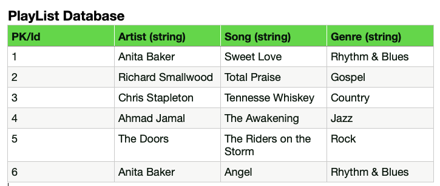

## Intro to Databases 9/27/2023 Foxtrot

- database: container that organizes data
- relational database: type of database that organizes data into table with rows and columns.
- database columns: establishes the type of data to place in the vertical section as well as the desired property
- database rows: represents the individual data entries or records in the horizontal section
database instance
database table
- schema: structure of the database table
- primary key: unique identifier for each row or data entry


- SQL: domain-specific language used for interacting with relational databases (CRUD actions)
- PostgreSQL: open-source relational database management system

- Relating databases to a Ruby class
```rb
# class declaration
  class PlayList
    attr_accessor(:artist, :song, :genre)
    def initialize(artist, song, genre)
      @artist = artist
      @song = song
      @genre = genre
    end
  end

# object (class instantiation)
  anita = PlayList.new('Anita', 'Angel', 'Rhythm & Blues')
```
- The `class name` is equivalent to the `name of the database`.
- The `scope` is similar to the `schema`.
- The `instance variables` are similar to the `columns` of the database.
- The `object` created from instantiation of the class is similar to the `rows` of the database.

- A relational database will store its data in rows and columns, which looks much like a table on an excel spreadsheet.  

  

- The `spreadsheet title` is equivalent to the `name of the database`.
- The group of `column names with the type of data` is similar to the `schema` of a database, which is the structure for that database.
- Each `column` is similar to each `column` of the database, which is the attribute or property and the type of value for that one column.
- Each `row` is similar to each `row` of the database, which are the individual records, instances, or data entries.


